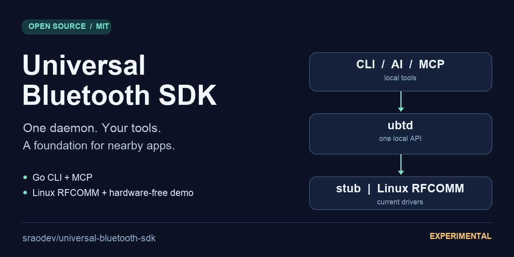

# Universal Bluetooth SDK

**A Go daemon and CLI for Bluetooth experiments, with AI and MCP integrations.**

Build against one local API. Try it without a radio, send RFCOMM payloads on Linux,
and help build the missing foundations for nearby chat and local AI assistants.

[](LICENSE.txt)
[](ROADMAP.md)
[](https://github.com/sraodev/universal-bluetooth-sdk/issues?q=is%3Aissue%20is%3Aopen%20label%3A%22help%20wanted%22)

[Quick start](#quick-start-without-bluetooth-hardware) · [Build chat apps](docs/CHAT_AND_LOCAL_AI.md) · [Contribute](CONTRIBUTING.md) · [Roadmap](ROADMAP.md)



> **Experimental, not production-ready.** The Go implementation supports a simulated
> driver and Linux RFCOMM sending. It does **not** implement BLE GATT, bidirectional
> chat, mesh routing, end-to-end encryption, or Bitchat interoperability.
> “Universal” describes the project direction, not current platform coverage.

## What can you build?

| Use case | Today | Next prerequisite |
|---|---|---|
| Raspberry Pi / Linux device commands | One-shot RFCOMM send to an existing compatible receiver | Hardware validation and bounded I/O |
| Bluetooth developer tools for agents | CLI, Claude planner, stdio MCP, saved plan replay | Enforced per-tool permissions |
| Local AI message drafts | Optional Ollama example; human reviews before sending | Receive sessions for a complete chat loop |
| Nearby BLE chat apps | Design and contributor backlog | GATT central/peripheral, framing, flow control |
| Bitchat-compatible clients | Not implemented or affiliated | Protocol study, test vectors, security and interoperability review |

The useful shared layer is radio access and messaging primitives. Your app owns
its UI, identity, conversation history, model runtime, and user consent.

## Quick start without Bluetooth hardware

Requires **Go 1.24+**. These POSIX-shell commands target Linux/macOS; Windows
runtime behavior has not been validated. The first build downloads dependencies.
No API key, model download, pairing, or root access is needed for the stub demo.

```bash
git clone https://github.com/sraodev/universal-bluetooth-sdk.git
cd universal-bluetooth-sdk
go build -o bin/ubtd ./cli/ubtd
go build -o bin/ubtctl ./cli/ubtctl
```

Terminal 1 — keep this running; stop with Ctrl-C:

```bash
mkdir -p "$HOME/.local/run/ubtd"
chmod 700 "$HOME/.local/run/ubtd"
./bin/ubtd --socket "$HOME/.local/run/ubtd/daemon.sock" --driver stub
```

Terminal 2:

```bash
export UBTD_SOCKET="$HOME/.local/run/ubtd/daemon.sock"
./bin/ubtctl ping
./bin/ubtctl status
./bin/ubtctl discover --scan-timeout 3
./bin/ubtctl send --address AA:BB:CC:DD:EE:01 --data 'hello'
```

Discovery returns the synthetic `stub-pi` and `stub-esp32` peers. Sending reports
`sent 5 bytes in 1234 µs`: **a simulation, not radio delivery or a benchmark**.
For an automated check that starts and cleans up its own daemon:

```bash
python3 scripts/smoke.py
```

## Real Bluetooth on Linux

The `linuxrfcomm` driver uses BlueZ's `bluetoothctl devices` to list **already
known devices**, not to perform a live scan. It opens a native RFCOMM socket for
sending. Configure pairing, adapter permissions, and a receiver separately.

On Debian/Raspberry Pi OS, install BlueZ with `sudo apt install bluez`. Then stop
the stub daemon and start `ubtd --driver linuxrfcomm` using the same private
socket path. Send using the receiver's actual address and RFCOMM channel (1–30):

```bash
./bin/ubtctl send --address AA:BB:CC:DD:EE:FF --port 1 --data 'hello'
```

The address is a placeholder. A successful write does not prove the remote app
processed the message. Do not assume raw Go payloads speak the legacy Python
SDK's length/acknowledgement/pickle protocol. Do not run the daemon as root by
default. See [hardware validation](docs/HARDWARE_TESTING.md) and [security](SECURITY.md).

## AI, MCP, and replay

- **Local AI:** [draft a short message with Ollama](examples/chat/README.md), review
  the saved text, then explicitly invoke `ubtctl send`. No automatic radio access.
- **Cloud planner:** `ubtctl ask --dry-run "check daemon status"` requires
  `ANTHROPIC_API_KEY`. It sends the goal and tool results to Anthropic and can incur
  charges. `--dry-run` suppresses sends; it does not make this an offline command.
- **MCP:** `ubtctl mcp --socket "$UBTD_SOCKET"` exposes daemon tools over stdio to
  a compatible client. The current server includes a send tool; use only trusted
  clients and their approval controls, preferably against the stub driver.
- **Replay:** `ubtctl plan run --dry-run plan.json` previews a saved trace without
  the daemon or an LLM. Executing mutating tools requires `--yes` before the path.

The cloud planner's `ask` command currently has **no `--yes` confirmation flag**:
without `--dry-run`, its tool calls can send. Do not confuse that with replay's
`--yes` gate. [CLI details and configuration](cli/ubtctl/README.md).

## Architecture and current scope

```text
CLI / Claude planner / MCP / saved plans
                  |
       length-prefixed JSON over local Unix socket
                  |
                 ubtd
                  |
           transport.Driver
             /         \
          stub       Linux RFCOMM
        simulated    one-shot send
```

| Component | Status |
|---|---|
| Go daemon, CLI, protocol | Implemented; automated tests and stub smoke check |
| Linux RFCOMM driver | Implemented; physical-device validation still required |
| macOS / Windows radio backends | Not implemented; macOS can run the stub |
| Python SDK | Legacy PyBluez implementation; unsafe pickle defaults, isolated labs only |
| Rust SDK, REST, gRPC, file-transfer and sensor apps | Placeholder directories, not working products |

The Go module still uses the historical import path
`github.com/sraodev/bluetooth-service-rfcomm-python`. Clone the current repository
URL above; module migration is tracked separately to avoid breaking consumers.
The JSON Go types are implemented in [`sdk/go/pkg/protocol`](sdk/go/pkg/protocol);
[`v1.proto`](common/protocol/v1.proto) is a design counterpart, not generated bindings.

## Help build the next milestone

We especially need **Linux/Raspberry Pi testers, Go contributors, BLE engineers,
and developers building chat apps**. Start with the
[good first issues](https://github.com/sraodev/universal-bluetooth-sdk/issues?q=is%3Aissue%20is%3Aopen%20label%3A%22good%20first%20issue%22)
or [help wanted backlog](https://github.com/sraodev/universal-bluetooth-sdk/issues?q=is%3Aissue%20is%3Aopen%20label%3A%22help%20wanted%22).
BLE, cryptography, and protocol work are not beginner tasks.

Read [CONTRIBUTING.md](CONTRIBUTING.md) for setup and a small first PR.
[ROADMAP.md](ROADMAP.md) gives acceptance gates, not promised dates.
If this is useful, star it to bookmark the project; a reproducible bug report,
hardware result, or example app helps even more.

[Documentation](docs/README.md) · [Security](SECURITY.md) · [Code of conduct](CODE_OF_CONDUCT.md) · [MIT license](LICENSE.txt)
